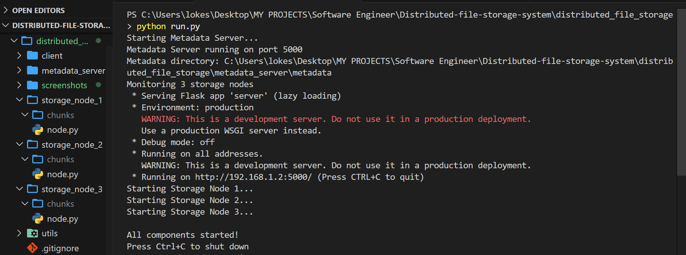

# Distributed File Storage System

A distributed file storage system inspired by Google Drive that implements chunking, replication, and fault tolerance in a distributed architecture.

## System Screenshots

### System Startup


### File Upload Process


### File Listing


### File Download


### File Deletion


## Features

- **File Chunking**: Splits large files into manageable chunks (1MB by default)
- **Distributed Storage**: Stores file chunks across multiple storage nodes
- **Replication**: Maintains multiple copies of each chunk for fault tolerance (2x by default)
- **Metadata Management**: Central server tracks file-to-chunk mappings
- **Fault Tolerance**: System continues to function when nodes go offline
- **Health Monitoring**: Continuously monitors node availability

## Architecture

The system consists of four main components:

1. **Storage Nodes**: Store and serve file chunks
2. **Metadata Server**: Manages file metadata and chunk locations
3. **Client Application**: Provides user interface for file operations
4. **Utility Libraries**: Provide common functionality like chunking and health monitoring


## Requirements

- Python 3.6+
- Dependencies listed in `requirements.txt`
- Windows, macOS, or Linux

## Quick Start


1. Install dependencies:
   ```
   pip install -r requirements.txt
   ```

2. Start the system:
   ```
   python run.py
   ```

## Usage

### Client Commands

Open a new terminal window and use the client application to interact with the system:

#### Check node status
```
python client/client.py status
```

#### Upload a file
```
python client/client.py upload <file_path>
```

#### List all files
```
python client/client.py list
```

#### Download a file
```
python client/client.py download <file_id> --output <output_path>
```

#### Delete a file
```
python client/client.py delete <file_id>
```

## How It Works

### Upload Process
1. File is split into chunks by the client
2. Client requests storage node allocation from metadata server
3. Chunks are uploaded to multiple nodes with replication
4. Chunk locations are registered with metadata server

### Download Process
1. Client requests file metadata from metadata server
2. Metadata server provides chunk locations and IDs
3. Client retrieves chunks from healthy nodes
4. Chunks are reassembled in the correct order

## System Components

### Storage Nodes
- Each node exposes REST APIs for chunk operations
- Nodes store chunks in their local filesystem
- Each chunk has associated metadata

### Metadata Server
- Maintains mapping between files and chunks
- Tracks where each chunk is stored
- Monitors node health
- Directs clients to healthy nodes

### Client Application
- Handles file chunking
- Manages upload/download coordination
- Provides user interface


## Project Structure

```
distributed_file_storage/
├── client/
│   └── client.py              # Client application
├── metadata_server/
│   └── server.py              # Metadata server
├── storage_node_1/
│   └── node.py                # Storage node 1
├── storage_node_2/
│   └── node.py                # Storage node 2
├── storage_node_3/
│   └── node.py                # Storage node 3
├── utils/
│   ├── chunker.py             # File chunking utilities
│   └── healthcheck.py         # Node health monitoring
├── .gitignore                 # Git ignore file
├── README.md                  # This file
├── requirements.txt           # Dependencies
├── run.py                     # Script to run all components
├── setup.bat                  # Windows setup script
└── start_system.bat           # Windows startup script
```

